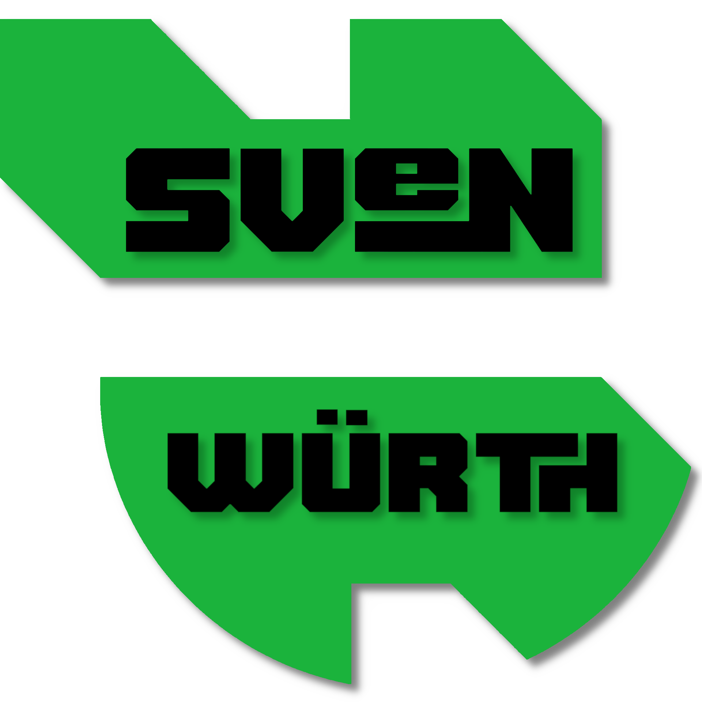

 

  

  <h1 align="center">Sven's Homer Dashboard</h1>

  

my "Homer" dashboard page with tools & links I use frequently.
     
     
    <a href="https://zigzockt.github.io/dashboard/">View Demo</a>
    .
    
    <a href="https://github.com/bastienwirtz/homer">Source</a>
  

------------------

 

  

  <h1 align="center">Sven's Homer Dashboard</h1>

  

meine "Homer" Dashboard Website mit Tools & Links, die ich häufig verwende.
     
     
    <a href="https://zigzockt.github.io/dashboard/">Schau dir die Demo an</a>
    .
    
    <a href="https://github.com/bastienwirtz/homer">Source</a>
  

